# Baking Story

If you like sweets and the process of making them this is the app for you!  Baking story will give you videos
and step-by-step guide to create awesome sweets. The app support both Phone and tablet devices so you can take it
to every place you want and start creating.

## Phone support
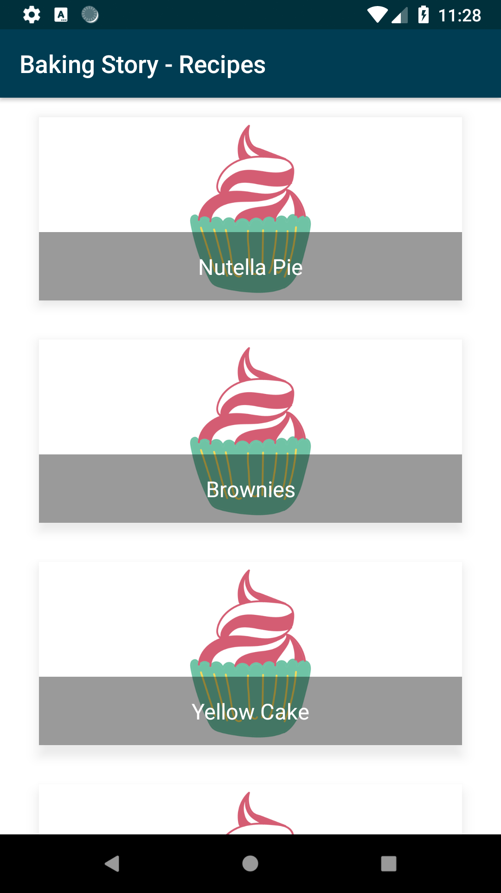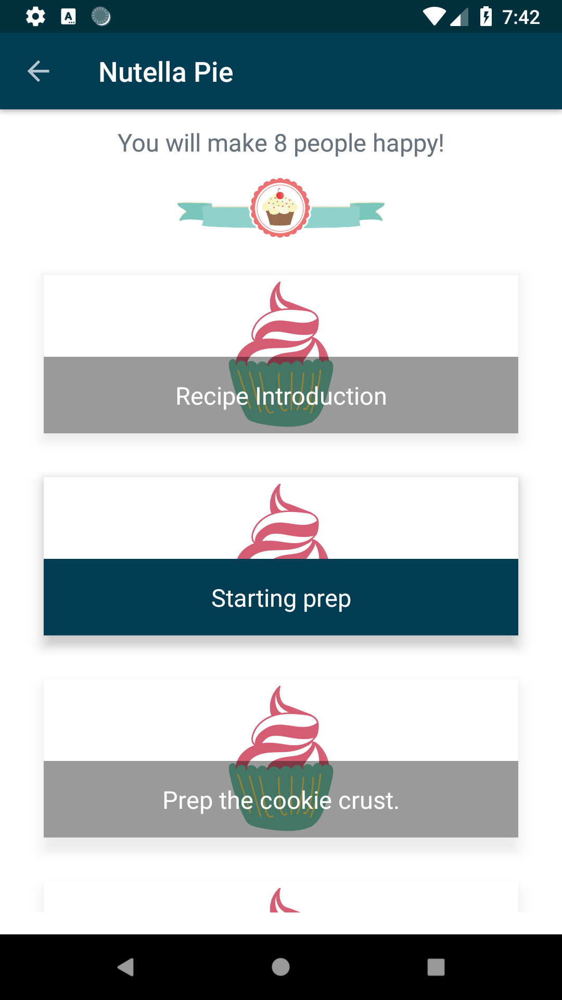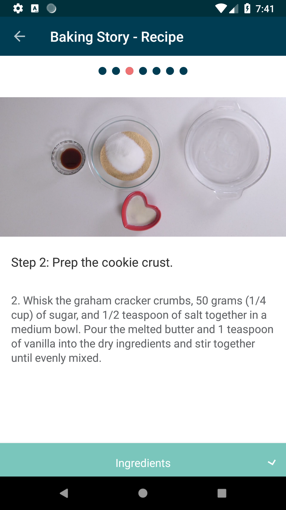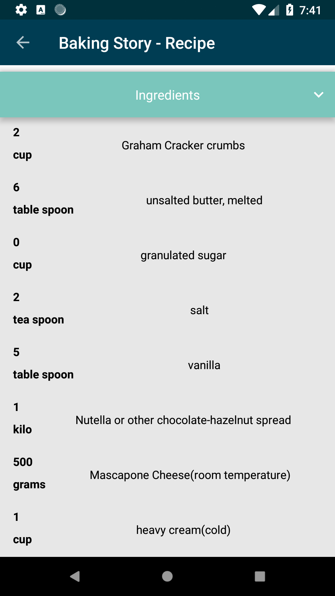

## Supports fullscreen videos
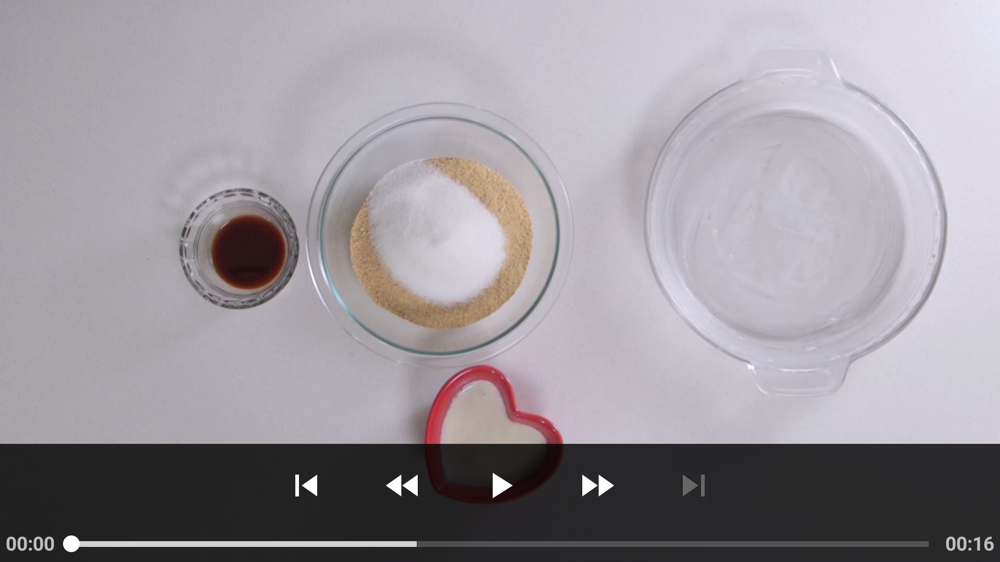

## Tablet support
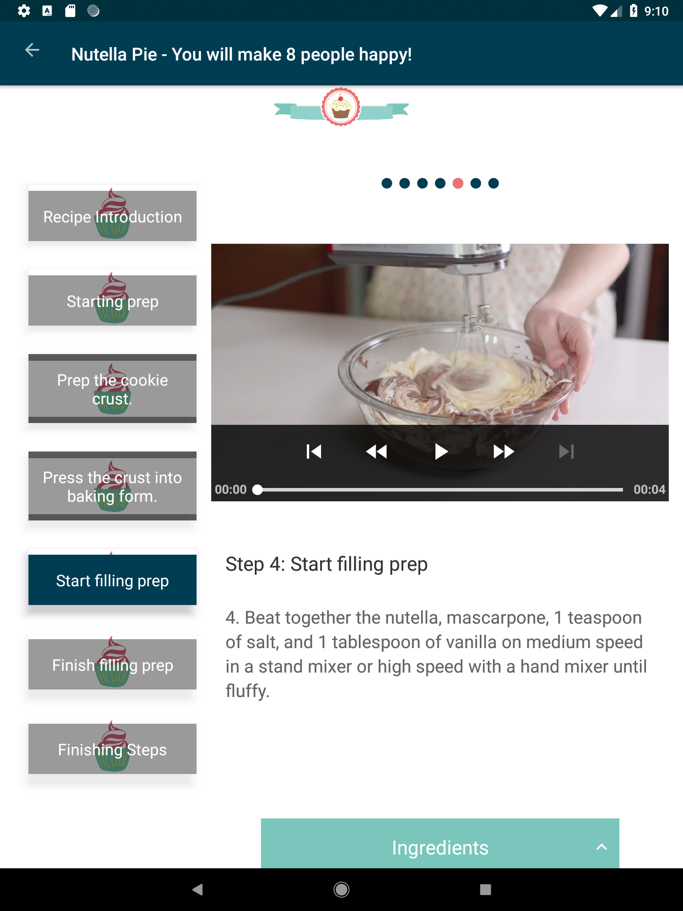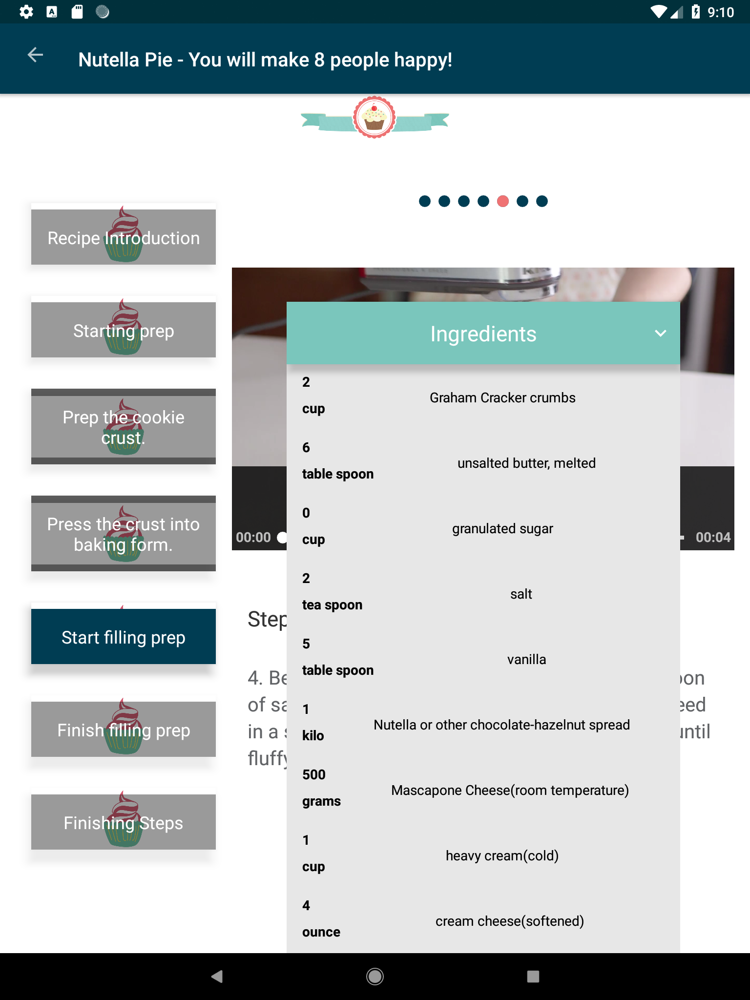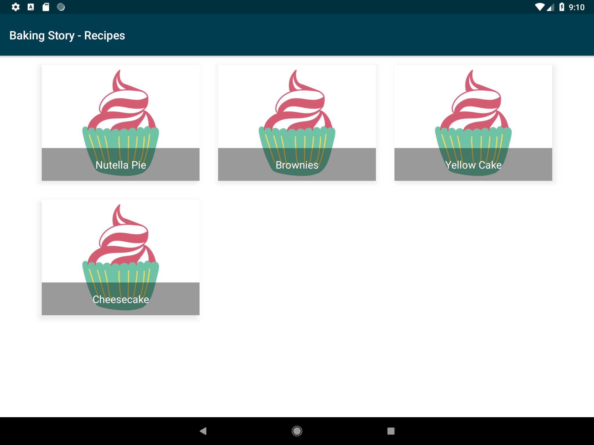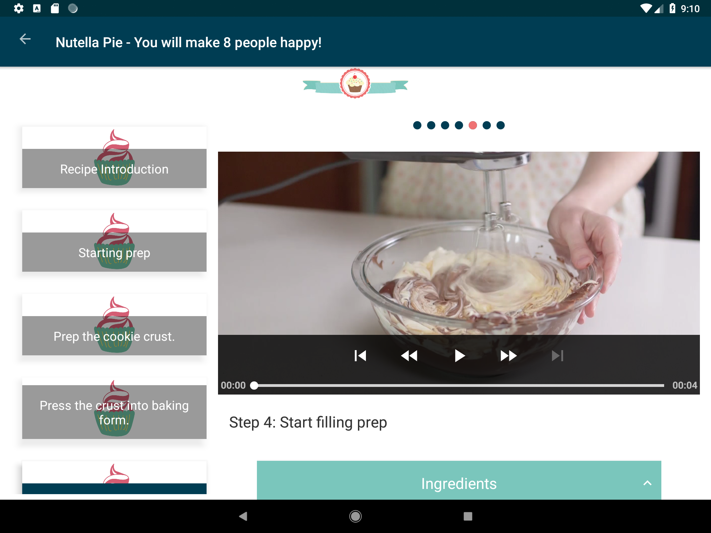

## Widget Ingredients
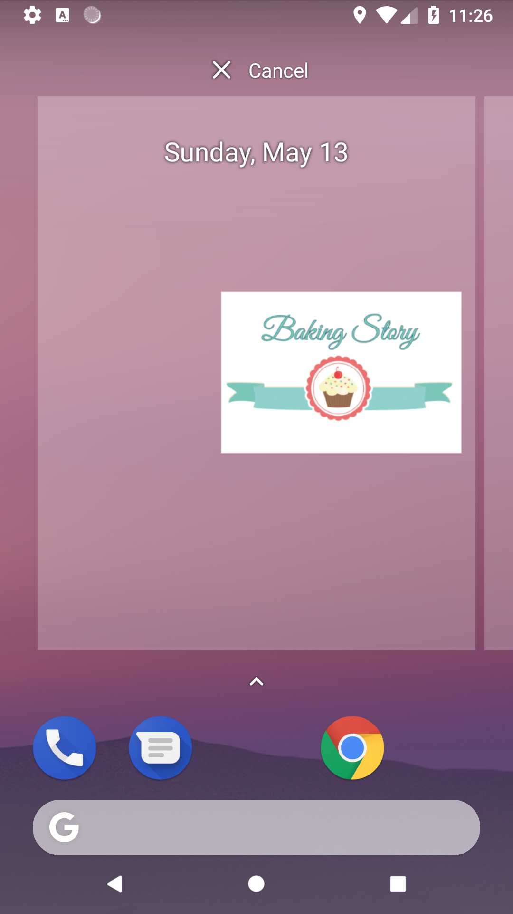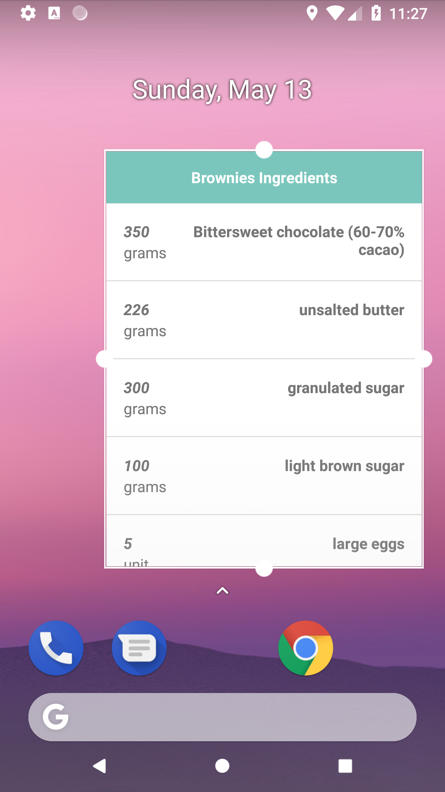

## Project Architecture

The project is build following the **Model-View-Presenter** Architecture and uses repository pattern for its data layer.

The project information is loaded from the [Baking API](https://d17h27t6h515a5.cloudfront.net/topher/2017/May/59121517_baking).

### Prerequisites

You will have to create your own account in order to request information from the API.
The API Key should be placed in **RestClient.java** which is responsible for creating the requests.

## Version Log
NEW v.1.0
- Recipes listing
- Baking steps with video and details.
- Hadning of no connection states.
- Instrumentation test with Espresso for phone and tablet devices.
- ExoPlayer implementation for baking steps videos.
- Cold start screen
- Widget for selected recipe

### Coding style 
The project follows the general coding style for Java and Android.

## Built With

* [Retrofit2](http://square.github.io/retrofit/) - Networking library from Square
* [JakeWharton's RxJava2 for Android](https://github.com/ReactiveX/RxAndroid) - Reactive solution for Android framework
* [Picasso](http://square.github.io/picasso/) - Image processing library
* [Stetho Logger](http://facebook.github.io/stetho/) - Debug bridge from Facebook. Used for network request debugging.
* [ExoPlayer](https://github.com/google/ExoPlayer) - ExoPlayer - media playback
## Contributing

Please read [CONTRIBUTING.md] for details on our code of conduct, and the process for submitting pull requests to us.

## Authors

* **[EIvanov](https://github.com/MobileEIvanov)** - *Initial work*

## Acknowledgments
* [Network Connection status](https://stackoverflow.com/questions/4238921/detect-whether-there-is-an-internet-connection-available-on-android)
* [Picasso Cashing](https://stackoverflow.com/questions/23978828/how-do-i-use-disk-caching-in-picasso)
* [JakeWharton - OkHttpDownloader](https://github.com/JakeWharton/picasso2-okhttp3-downloader)
* [Google Testing](https://github.com/googlesamples/android-testing)
* [Circular Reveal Animation](https://stackoverflow.com/questions/41132475/translation-animation-starts-off-screen-instead-of-where-it-belongs) 
* [Page indicator](https://github.com/romandanylyk/PageIndicatorView) 
* [Widget Implementation](https://github.com/udacity/AdvancedAndroid_MyGarden)
## License

    Licensed under the Apache License, Version 2.0 (the "License");
    you may not use this file except in compliance with the License.
    You may obtain a copy of the License at

        http://www.apache.org/licenses/LICENSE-2.0

    Unless required by applicable law or agreed to in writing, software
    distributed under the License is distributed on an "AS IS" BASIS,
    WITHOUT WARRANTIES OR CONDITIONS OF ANY KIND, either express or implied.
    See the License for the specific language governing permissions and
    limitations under the License.

